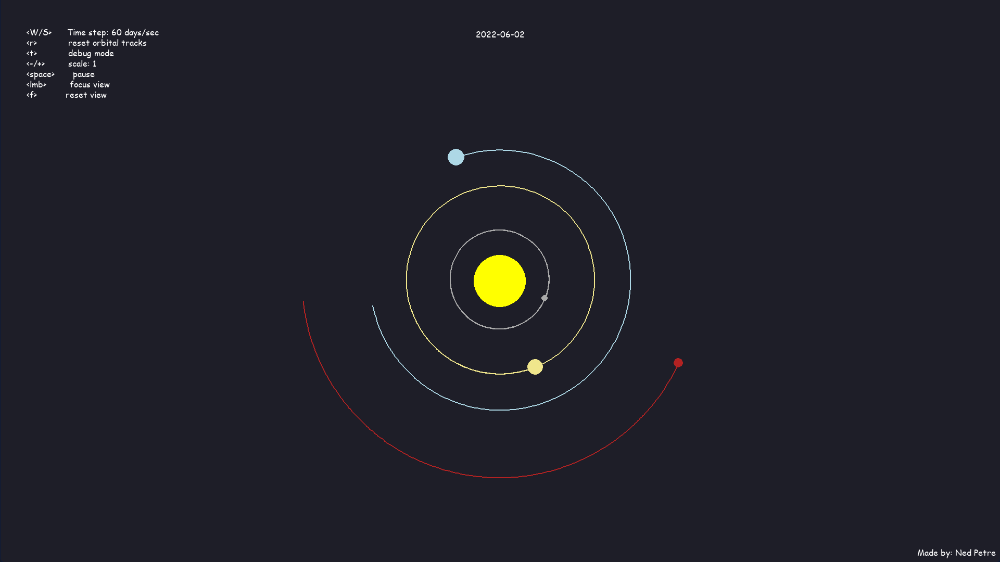

# Solar System Simulation 🌍🌞🪐

This is a simple solar system simulation program built using **Python** and **Pygame**. It models the Sun and several planets, simulating their orbits using Newton's law of universal gravitation. The program also allows users to calculate the angle between Earth, Mars, and the Sun during the simulation.

## Features

- **Realistic Orbital Simulation**: Simulates the gravitational forces and planetary motions using physically accurate values for mass, distance, and velocity.
- **Adjustable Time Step**: Speed up or slow down the simulation using keyboard inputs.
- **Orbital Tracking**: Visualize the paths taken by each planet as they orbit the Sun.
- **Angle Calculation**: Calculate and display the angle between Earth, Mars, and the Sun.
- **Interactive Display**: Reset orbital paths and manage time increments interactively.

## Requirements

- **Python 3.6+**
- **Pygame** (Python library for creating 2D games and visualizations)

You can install the required dependencies using pip:

```bash
pip install pygame
```

## How to Run

1. Clone this repository:

   ```bash
   git clone https://github.com/NedPetre/solar-system-simulation.git
   ```

2. Navigate to the project directory:

   ```bash
   cd solar-system-simulation
   ```

3. Run the simulation:

   ```bash
   python main.py
   ```

## Controls

- **`Q`**: Decrease time step (slow down simulation).
- **`W`**: Increase time step (speed up simulation).
- **`R`**: Reset orbital tracks.
- **`T`**: Display the angle between Earth, Mars, and the Sun.

## Key Components

- **Planet Class**: Models each planet's position, velocity, mass, and handles gravitational interactions with other planets.
- **Date Class**: Manages and updates the simulation date as time progresses.
- **Angle Calculation**: Uses the law of cosines to compute the angle between Earth, Mars, and the Sun.

## How It Works

- The program uses **Newton's law of gravitation** to calculate the forces between planets, then updates their positions and velocities using these forces.
- The simulation runs in real-time, with adjustable time steps, and planets leave trails showing their orbits.
- The angle calculation between Earth, Mars, and the Sun is displayed when the `T` key is pressed, showing the current relative positions of these celestial bodies.

## Future Improvements

- Add more planets and moons.
- Include better handling for zooming and panning around the solar system.
- Improve performance with larger-scale systems or higher precision simulations.
- Add realistic 3D elements for more immersive visuals.

## Screenshots



## License

This project is licensed under the MIT License - see the [LICENSE](LICENSE) file for details.
